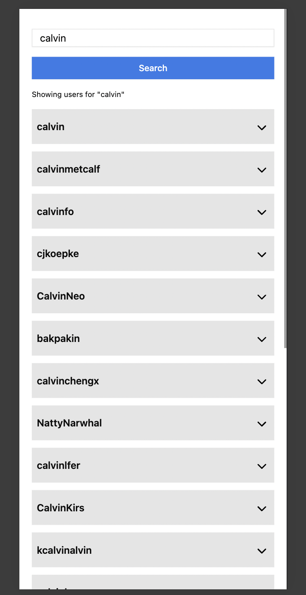
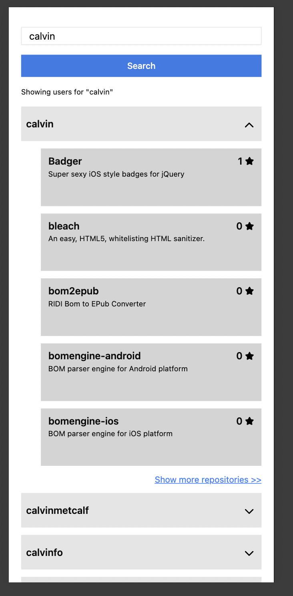

# GitHub Repositories Explorer

A simple web application that allows you to search for GitHub users and explore their public repositories.




## 🚀 Features

- Search GitHub users by username
- View user profile usernames
- Explore public repositories of each user
- Pagination with “Load More” support
- Fast and responsive UI

## 🛠️ Built With

- [React](https://reactjs.org/)
- [Vite](https://vitejs.dev/)
- [Axios](https://axios-http.com/)
- [Lucide React Icons](https://lucide.dev/)
- [shadcn/ui](https://ui.shadcn.dev/) (for Accordion and styling)
- [GitHub REST API v3](https://docs.github.com/en/rest)
- [React Hook Form](https://react-hook-form.com/)
- [React Query / Tanstack](https://tanstack.com/query/latest)

## 📦 Getting Started

### Prerequisites

- Yarn or npm

### Installation

```bash
git clone https://github.com/your-username/github-repositories-explorer.git
cd github-repositories-explorer
yarn install
